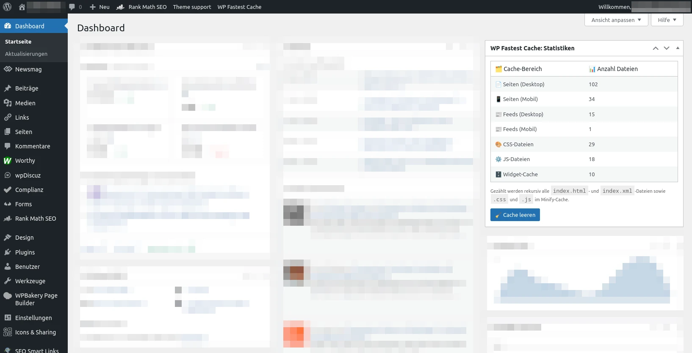

# WPFC Cache-Statistiken im Dashboard

Ein kleines WordPress-Plugin, das Cache-Statistiken von [WP Fastest Cache](https://wordpress.org/plugins/wp-fastest-cache/) direkt im Admin-Dashboard anzeigt. Zusätzlich bietet es einen Button zum vollständigen Leeren des Caches per `wp fastest-cache clear all`.

## Funktionen

✅ Anzeige der Anzahl gecachter Inhalte:

- **Seiten (Desktop):** Anzahl der `index.html`-Dateien im Desktop-Cache
- **Seiten (Mobil):** Anzahl der `index.html`-Dateien im mobilen Cache
- **Feeds (Desktop):** Anzahl der `index.xml`-Dateien im Feed-Cache
- **CSS-Dateien:** Anzahl minifizierter `.css`-Dateien
- **JS-Dateien:** Anzahl minifizierter `.js`-Dateien
- **Widget-Cache:** Anzahl Dateien im Widget-Cache (nur Premium)

🧹 **Cache leeren**:
Ein Button im Widget ermöglicht das Leeren des kompletten Caches via Kommandozeile.

🔄 **Automatische Aktualisierung**:
Nach dem Leeren werden die Statistiken direkt neu geladen – ohne Seitenreload.



## Voraussetzungen

- WordPress
- [WP Fastest Cache](https://wordpress.org/plugins/wp-fastest-cache/) installiert und aktiviert
- Shell-Zugriff mit dem Kommando `wp fastest-cache clear all` (z. B. über WP-CLI)
- PHP `shell_exec()` ist aktiviert
- Benutzerrolle mit `manage_options`-Rechten

## Installation

1. Dieses Repository herunterladen oder klonen

   ```bash
   git clone https://github.com/linuxundich/wpfc-cache-stats-dashboard.git
   ```

2. Ordner `wpfc-cache-stats-widget` nach `/wp-content/plugins` kopieren
