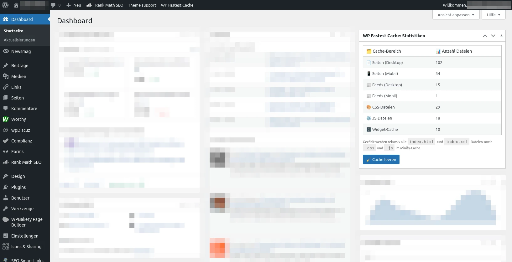

# WPFC Cache-Statistiken im Dashboard

Ein kleines WordPress-Plugin, das Cache-Statistiken von [WP Fastest Cache](https://wordpress.org/plugins/wp-fastest-cache/) direkt im Admin-Dashboard anzeigt und einen Button zum Leeren des Caches bietet.

## Funktionen

✅ **Cache-Abdeckung der Beiträge:** Wie viele veröffentlichte Beiträge liegen im Seiten-Cache? Nicht gecachte Beiträge muss WordPress bei jedem Aufruf neu erzeugen – die wichtigste Kennzahl, wenn der Server unter Last gerät.

✅ **Anzahl und Größe gecachter Inhalte:**

- **Seiten (Desktop/Mobil):** `index.html`-Dateien im jeweiligen Cache (Mobil nur, wenn vorhanden)
- **Feeds:** `index.xml`-Dateien
- **Minifiziertes CSS/JS:** Anzahl und Größe
- **Widget-Cache:** nur, wenn vorhanden (Premium)

✅ **Alter und Verlauf:** älteste/neueste Cache-Seite, Preload-Status und – mit WPFC Premium – die letzten Cache-Löschungen samt Auslöser.

🧹 **Cache leeren:** Button mit Sicherheitsabfrage, optional inklusive minifizierter CSS/JS-Dateien. Nutzt die WPFC-eigene Schnittstelle (`wpfc_clear_all_cache`), braucht also weder Shell noch WP-CLI.

## Performance

- Das Dashboard wartet nie auf die Statistik: Sie wird per AJAX nachgeladen und 15 Minuten zwischengespeichert (Transient).
- Ein einziger Verzeichnisdurchlauf pro Cache-Bereich (Version 2.0 brauchte fünf).
- Die Beitragsabdeckung vergleicht nur Verzeichnisnamen mit den Slugs der Beiträge – eine schlanke Datenbankabfrage, keine Permalink-Berechnung pro Beitrag.
- Kein jQuery.



## Voraussetzungen

- WordPress ab 6.2, PHP ab 8.0
- [WP Fastest Cache](https://wordpress.org/plugins/wp-fastest-cache/) installiert und aktiviert
- Benutzerrolle mit `manage_options`-Rechten

Die Beitragsabdeckung setzt eine Permalink-Struktur voraus, die mit `%postname%` endet.

## Installation

1. Dieses Repository herunterladen oder klonen

   ```bash
   git clone https://github.com/linuxundich/wpfc-cache-stats-dashboard.git
   ```

2. Ordner `wpfc-cache-stats-widget` nach `/wp-content/plugins` kopieren

## Änderungen

**3.0**
- Statistik asynchron und gecacht statt bei jedem Dashboard-Aufruf, ein Verzeichnisdurchlauf statt fünf
- Neu: Cache-Abdeckung der Beiträge, Größen, Alter, Preload-Status, letzte Cache-Löschungen
- Cache leeren über WPFC-Schnittstelle statt `shell_exec` + WP-CLI, mit Sicherheitsabfrage
- Behoben: Nach dem Leeren wurde der komplette Widget-Rahmen ersetzt und der Button funktionierte nicht mehr
- Behoben: AJAX-Refresh ohne Nonce- und Rechteprüfung; Widget erschien für alle Rollen (leer)
- Funktionsnamen mit Präfix, jQuery entfernt
